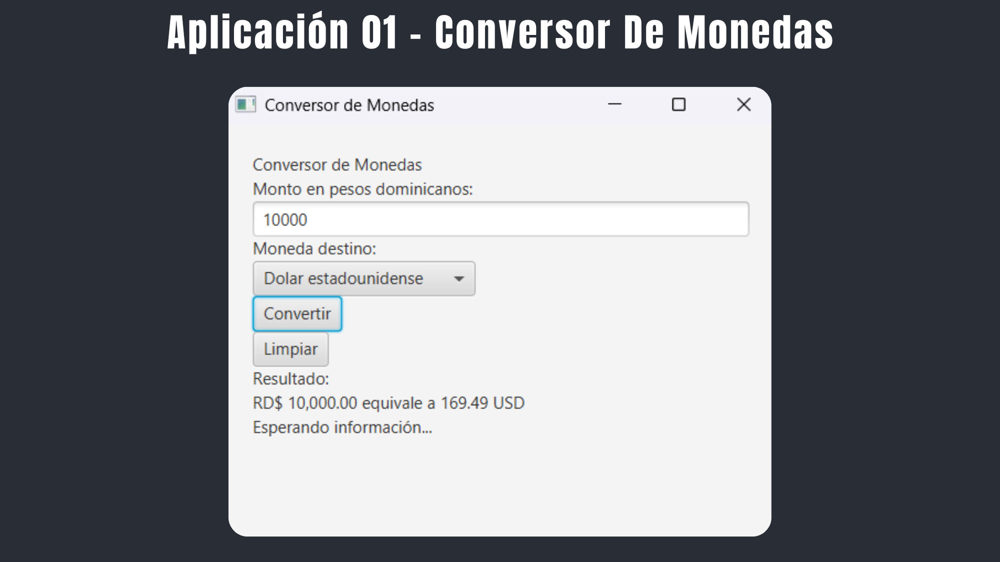
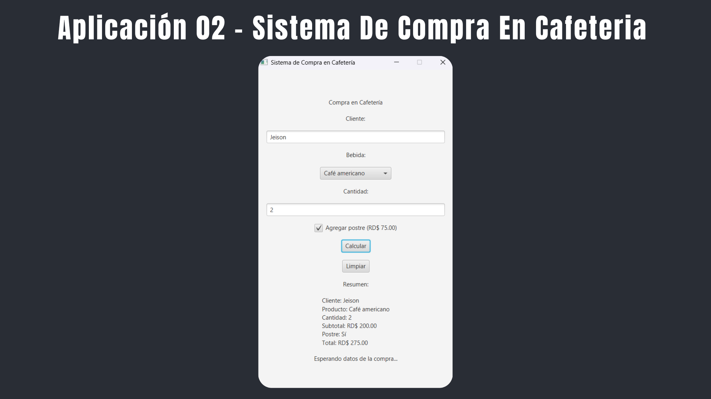
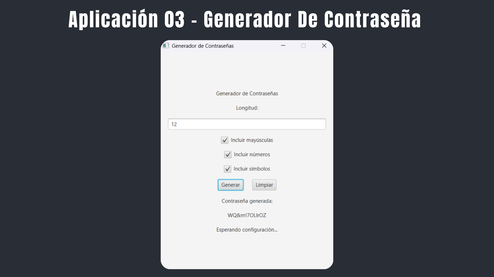

# 💻 Práctica en Clase - Eventos en JavaFX

## 🧑‍🎓 Datos del Estudiante

* **Estudiante:** Jeison Amparo Abreu
* **Matrícula:** 1000-5296
* **Materia:** Programación 3

---

## 📝 Descripción

Proyecto desarrollado en JavaFX con el objetivo de practicar el manejo de eventos utilizando la arquitectura **FXML + Controller**. Se implementaron tres aplicaciones independientes que permiten interactuar con distintos controles de JavaFX mediante los eventos `ActionEvent`, `MouseEvent` y `KeyEvent`.

Cada aplicación fue desarrollada siguiendo la separación entre la interfaz gráfica (FXML) y la lógica del programa (Controller), además de utilizar hojas de estilo CSS para mejorar la presentación visual.

---

## 🚀 Aplicaciones Implementadas

1. **Conversor de Monedas**
2. **Sistema de Compra en Cafetería**
3. **Generador de Contraseñas**

---

## 🛠️ Controles JavaFX utilizados

Durante el desarrollo de las aplicaciones se utilizaron los siguientes controles:

* Label
* TextField
* Button
* ComboBox
* CheckBox
* VBox
* HBox

---

## ⚡ Eventos implementados

En las tres aplicaciones se trabajó con los siguientes tipos de eventos:

* **ActionEvent**
  * Ejecutar la acción principal.
  * Limpiar los controles de la interfaz.

* **MouseEvent**
  * Mostrar mensajes de ayuda cuando el cursor entra o sale de los botones.

* **KeyEvent**
  * Ejecutar automáticamente la acción principal al presionar la tecla **ENTER**.

---

## 📄 Descripción de las Aplicaciones

### 💱 Aplicación 1 - Conversor de Monedas

Aplicación que permite convertir una cantidad en pesos dominicanos (DOP) a dólares estadounidenses (USD) o euros (EUR). Incluye validación de datos, conversión mediante tasas fijas, mensajes de ayuda y limpieza de los controles.

### ☕ Aplicación 2 - Sistema de Compra en Cafetería

Aplicación para simular una compra en una cafetería. Permite seleccionar una bebida, indicar la cantidad, agregar un postre opcional y calcular automáticamente el total de la compra mostrando un resumen detallado.

### 🔐 Aplicación 3 - Generador de Contraseñas

Aplicación que genera contraseñas personalizadas según la longitud indicada y las opciones seleccionadas por el usuario, pudiendo incluir letras mayúsculas, números y símbolos.

---

## 🛠️ Tecnologías utilizadas

* **Lenguaje:** Java
* **Framework:** JavaFX
* **FXML**
* **CSS**
* **JDK:** 17
* **Editor de código:** Visual Studio Code

---

## 📂 Estructura del Proyecto

```text
EJERCICIO-CLASES-JAVAFX-EVENTOS/
│
├── App1-ConversorMonedas/
│   ├── .vscode/
│   ├── bin/
│   ├── lib/
│   └── src/
│       ├── controller/
│       │   └── PrincipalController.java
│       ├── view/
│       │   └── Principal.fxml
│       └── App.java
│
├── App2-SistemaCompraCafeteria/
│   ├── .vscode/
│   ├── bin/
│   ├── lib/
│   └── src/
│       ├── controller/
│       │   └── PrincipalController.java
│       ├── view/
│       │   └── Principal.fxml
│       └── App.java
│
├── App3-GeneradorContrasena/
│   ├── .vscode/
│   ├── bin/
│   ├── lib/
│   └── src/
│       ├── controller/
│       │   └── PrincipalController.java
│       ├── view/
│       │   └── Principal.fxml
│       └── App.java
│
├── evidencias/
│   ├── App1-ConversorMonedas.png
│   ├── App2-SistemaCompraCafetera.png
│   └── App3-GeneradorContrasena.png
│
├── Preguntas De Reflexion/
│   └── Programación III - Preguntas De Reflexión.pdf
│
└── README.md
```

---

## 📸 Evidencias del Proyecto

A continuación, se presentan las capturas de pantalla de las tres aplicaciones desarrolladas.

### 1. Conversor de Monedas



### 2. Sistema de Compra en Cafetería



### 3. Generador de Contraseñas



---

## 🧑‍💻 Cómo ejecutar el proyecto

1. Clona el repositorio:

```bash
git clone <URL_DEL_REPOSITORIO>
```

2. Entra a la aplicación que deseas ejecutar:

```bash
cd App1-ConversorMonedas
```

o

```bash
cd App2-SistemaCompraCafeteria
```

o

```bash
cd App3-GeneradorContrasena
```

3. Compila y ejecuta el proyecto desde Visual Studio Code o cualquier IDE compatible con JavaFX utilizando la configuración correspondiente para JavaFX y JDK 17.